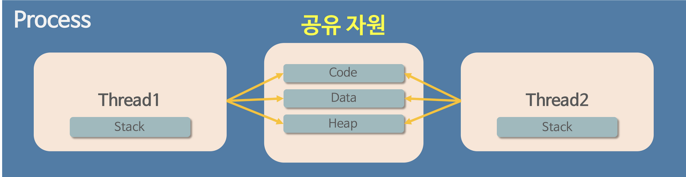

## Development common sense

- [웹 표준(Web Standards)](<#웹-표준(Web-Standards)>)
- [객체 지향 프로그래밍이란?](#객체-지향-프로그래밍이란?)
- [REST API란?](#REST-API란?)
- [HTTP vs HTTPS](#HTTP-vs-HTTPS)
- [HTTP 상태코드](#HTTP-상태코드)
- [프로세스 생성과정](#프로세스-생성과정)
- [프로세스와 스레드를 비교](#프로세스와-스레드를-비교)
- [TCP와 UDP의 차이점은?](#TCP와-UDP의-차이점)
- [TCP 3-way-handshake](#TCP-3-way-handshake)
- [AJAX란?](#-AJAX란?)
- [SEO?](#SEO?)
- [웹 스토리지의 차이점](#웹-스토리지의-차이점)
- [JWT란? JWT외에 쓸 수 있는 다른 방법은?](#JWT)

    
    
    

# 웹 표준(Web Standards)

- 웹 표준이란?  
  '웹에서 표준적으로 사용되는 기술이나 규칙' 으로 표준화 단체인 W3C가 권고한 표준안에 따라 웹사이트를 작성할 때 이용하는 HTML, CSS, JavaScript 등에 대한 규정이 담겨있습니다. 어떤 운영체제나 브라우저를 사용하더라도 웹 페이지가 동일하게 보이고 정상 작동해야함을 의미합니다.

- 웹 접근성  
  모든 사용자가 신체적, 환경적 조건에 관계없이 웹에 접근하여 이용할 수 있도록 보장하는 것입니다.

    
    

# 객체 지향 프로그래밍이란?

Object Oriendted Programming
프로그래밍에서 필요한 데이터를 추상화시켜 상태와 행위를 가진 객체를 만들고 그 객체들 간의 유기적인 상호작용을 통해 로직을 구성하는 프로그래밍 방법이다.

### 장점

- 코드 재사용이 용이하다.
- 절차 지향 프로그래밍에서는 코드를 일일히 찾아서 수정해야하는 반면에 객체 지향 프로그래밍에서는 수정해야할 부분이 클래스 내부에 변수 혹은 메서도로 존재하기 때문에 해당 부분만 수정하면 되기에 유지보수가 쉽다
- 대형 프로젝트에 적합하다. 클래스 단위 모듈화시켜서 개발할 수 있으므로 프로젝트 개발 할 때 업무 분담하기 쉽다
    

### 단점

- 처리속도가 상대적으로 느리다
- 객체가 많으면 용량이 커질 수 있다
- 설계시 많은 시간과 노력이 필요하다
    
    

# REST API란?

- Representational State Transfer 라는 용어의 약자로 자원을 이름으로 구분하여 해당 자원의 상태(정보)를 주고 받는 모든 것을 의미
- HTTP URI(Uniform Resource Identifier)를 통해 자원(Resource)을 명시하고, HTTP Method(POST, GET, PUT, DELETE)를 통해 해당 자원에 대한 CRUD Operation을 적용하는 것을 의미
간단하게 말하자면 HTTP 통신에서 어떤 자원에 대한 CRUD 요청을 Resource와 Method로 표현하여 특정한 형태로 전달하는 방식을 의미
    

### REST 구성

- 자원(Resource) - URL
- 행위(Verb) - HTTP METHOD
- 표현(Representations)

URL는 정보의 자원을 표현하고 자원에 대한 행위는 method (GET,POST,PUT,DELETE)로 표현한다.
  

### REST의 장단점

- 장점
  - HTTP 프로토콜의 인프라를 그대로 사용하므로 REST API 사용을 위한 별도의 인프라를 구출 할 필요가 없다.
  - HTTP 표준 프로토콜에 따르는 모든 플랫폼에서 사용이 가능하다.
  - REST API 메시지가 의도하는 바를 명확하게 나타내므로 의도하는 바를 쉽게 파악할 수 있다.
  - 서버와 클라이언트의 역할을 명확하게 분리한다.
- 단점
  - 표준이 존재하지 않는다.
      

### REST가 필요한 이유

- 애플리케이션 분리 및 통합
- 최근의 서버 프로그램은 다양한 브라우저와 안드로이드폰, 아이폰과 같은 모바일 디바이스에서도 통신을 할 수 있어야 한다.

### REST 규칙
- URI는 명사를 사용한다
- 슬래시로 계층관계 표현
- URI의 마지막에는 슬래시를 붙이지 않는다
- URI는 소문자로만 구성한다
- 가독성이 떨어지는 경우 하이픈을 사용한다
    

## RESTful 이란?

RESTful은 일반적으로 REST라는 아키텍처를 구현하는 웹 서비스를 나타내기 위해 사용되는 용어이다. 이해하기 쉽고 사용하기 쉬운 REST API(어플리케이션 프로그래밍 인터페이스)를 만드는 것이 목적이다.

  
  

# HTTP vs HTTPS

### HTTP

- HyperText Transfer Protocol
- W3 상에서 정보를 주고 받을 수 있는 프로토콜
- 주로 TCP를 사용하고 HTTP/3부터는 UDP를 사용하며 80번 포트를 사용

### HTTPS

- HyperText Transfer Protocol over Secure Socket Layer, HTTP over TLS, HTTP over SSL, HTTP Secure
- 월드 와이드 웹 통신 프로토콜인 HTTP의 보안이 강화된 버전
- TCP/IP 443번 포트 사용
- 기존 HTTP 레이어에 SSL(TLS) 프로토콜을 얹어 평문 데이터를 암호화
- 인증, 전자상거래와 같은 민감함 트래픽에 이용

### 두 개의 가장 큰 차이점

- SSL 인증서
  사용자가 사이트에 제공하는 정보를 암호화하는데, 쉽게 말해서 데이터를 암호로 바꾼다고 생각하면 이해가 쉽다. 전송된 데이터를 누군가가 훔쳐낸다고 해도 데이터가 암호화되어있기때문에 해독할 수가 없다.

### HTTPS를 사용하는 이유

- 기밀성  
  HTTPS는 인터넷과 같은 공공매체에서 두 참여자 간의 통신을 보호한다
- 무결성 
  HTTPS는 변조되지 않은 정보로 목적지에 도달하게 한다.
- 인증  
  HTTPS를 통해 웹사이트의 진위 여부를 확인할 수 있다.

    
    

# HTTP 상태코드

HTTP 상태 코드는 클라이언트가 보낸 HTTP 요청에 대한 서버의 응답 코드로, 상태 코드에 따라 요청의 성공/실패 여부를 판단합니다. 상태코드는 코드의 첫번째 숫자에 따라서 5가지로 분류가 됩니다. 상태 코드는 3자리 숫자로 만들어져 있으며, 첫번째 자리는 1에서 5까지 제공됩니다. 첫번째 자리가 4와 5인 경우는 정상적인 상황이 아니기 때문에 사이트 관리자가 즉시 알아야 하는 정보입니다.

- 1xx (정보) : 요청을 받았으며 프로세스를 계속 진행합니다.
- 2xx (성공) : 요청을 성공적으로 받았으며 인식했고 수용하였습니다.
- 3xx (리다이렉션) : 요청 완료를 위해 추가 작업 조치가 필요합니다.
- 4xx (클라이언트 오류) : 요청의 문법이 잘못되었거나 요청을 처리할 수 없습니다.
- 5xx (서버오류) : 서버가 명백히 유효한 요청에 대해 충족을 실패했습니다.

    
    

# 프로세스 생성과정

- 프로세스란? 운영체제(operating system)에서 프로그램(program)을 수행시키는 주체이다

1. PCB(프로세스 제어 블록)가 생성되며 OS(운영체제)가 실행한 프로그램의 코드를 읽어들여 프로세스에 할당된 메모리의 Text segment에 저장한다.
2. 초기화된 전역 변수 및 static 변수를 data segment에 할당.
3. HEAP과 Stack은 초기 메모리 주소만 초기화됨.
4. PCB에 여러 정보가 기록되면 Ready Queue에서 CPU를 할당받기까지 대기한다.

생성 시스템 호출을 통해 새로운 프로세스를 생성할 수 있는데, 이때 생성하는 프로세스를 부모 프로세스, 새로운 프로세스를 자식 프로세스라고 부릅니다. 이렇게 만들어진 프로세스가 또 다른 프로세스를 만들 수가 있는데, 이 과정이 반복되면서 프로세스 트리를 형성합니다.

이 때 process Id(pid)를 가지게 되고 정수 1의 init 프로세스가 루트 부모 프로세스 역할을 수행합니다. 이 초기 값의 프로세스를 제외한 프로세스는 fork(), exec()를 이용한 클론방식으로 생성이 되며 자식 프로세스가 실행되는 동안 부모 프로세스가 할 일이 없다면 부모 프로세스는 자식 프로세스가 종료될 때까지 wait() 시스템을 호출하고, 자식 프로세스가 끝나면 exit() 시스템을 호출하여 죵료됩니다.
  

### 크롬탭이 프로세스 인가요? 쓰레드인가요?

크롬은 탭마다 PID를 가지고 있으니 Process이며 각 Tab마다 랜더링 정보나 기타 데이터를 따로 관리한다고 한다. 그로인해 메모리를 많이 잡아먹기도 하지만 하나의 Tab에 오류가 생겼다고 모든 Tab에 영향을 끼치진 않는다.

  
  

# 프로세스와 스레드를 비교

프로그램이란, 파일이 저장 장치에 저장되어 있지만 메모리에는 올라가 있지 않은 정적인 상태인데. 프로그램을 실행하는 순간 해당 파일은 컴퓨터 메모리에 올라가게 되고, 이 상태를 동적(動的)인 상태라고 하며 이 상태의 프로그램을 프로세스라고 합니다. 즉 프로그램의 실행중인 인스턴트입니다. 스레드는 프로세스의 하위 집합이며 경량 프로세스라고 합니다. 프로세스 내의 더 가벼운 공유 메모리 단위로 작업의 효율적인 병렬 실행을 가능하게 합니다. 프로세스가 서로 다른 메모리 공간에서 실행되는 반면 동일한 프로세스의 스레드는 공유 메모리 공간에서 실행된다는 점에서 차이가 있습니다. 
운영체제는 프로세스마다 각각 독립된 메모리 영역을 code/data/stack/heap의 형식으로 할당해줍니다. 각각 독립된 메모리 영역을 할당해주기 때문에 프로세스는 다른 프로세스의 변수나 자료에 접근할 수 없습니다. 이와 다르게 스레드는 메모리를 서로 공유할 수 있습니다. 메모리 영역에 stack형식으로 할당된 메모리 영역을. 할당받고 나머지 code /data/heap 형식으로 할당된 메모리 영역을 공유합니다. 따라서 각각 스레드는 별도의 스택을 가지고 있지만 힙 메모리는 서로 읽고 쓸 수 있습니다.

멀티태스킹이 하나의 운영 체제 안에서 여러 프로세스가 실행되는 것이라면, 멀티스레드는 하나의 프로세스가 여러 작업을 여러 스레드를 사용하여 동시에 처리하는 것을 의미

운영체제가 프로세스에게 Code/Data/Stack/Heap 메모리 영역을 할당해 주고 최소 작업 단위로 삼는 반면, 스레드는 프로세스 내에서 Stack 메모리 영역을 제외한 다른 메모리 영역을 같은 프로세스 내 다른 스레드와 공유한다. 프로세스는 다른 프로세스와 정보를 공유하려면 IPC를 사용하는 등의 번거로운 과정을 거쳐야 하지만, 스레드는 기본 구조 자체가 메모리를 공유하는 구조이기 때문에 다른 스레드와 정보 공유가 쉽다. 때문에 멀티태스킹보다 멀티스레드가 자원을 아낄 수 있게 된다. 다만 스레드의 스케줄링은 운영체제가 처리하지 않기 때문에 프로그래머가 직접 동기화 문제에 대응할 수 있어야 한다.

  
  

# TCP와 UDP의 차이점

- TCP란? 데이터의 송수신을 위해 IP를 이용하는 포로토콜이며 통시니간에 신뢰성을 보장해주기 위해 만든 것이다. TCP는 3-way handshake라고 불리는 연결 동작과 4-way handshake라고 불리는 연결 종료를 통해 ACK와 Sequence Number를 주고 받아 데이터 흐름의 신뢰성을 구축한다.

TCP는 연결 동작을 통해 ACK와 Sequence Number를 주고받으며 신뢰성과 흐름제어를 제공하는 방면 UDP는 IP를 거의 그대로 사용하며 단순히 Checksum말고는 데이터의 훼손을 감지할 수 없다. 또한 ACK와 Sequence Number를 주고받지 않으므로 중간에 데이터가 유실되어도 이를 다시 요청하거나 할 수 있는 방법이 없다. 또한 TCP와 다르게 UDP는 혼잡을 제어할 수 있는 방법이 없다.

  
  

# TCP-3-way-handshake

전송 제어 프로토콜 (TCP)에서 통신을 하는 장치간 서로 연결이 잘 되어있는지 확인하는 과정이자 방법입니다.
네트워크란 데이터를 교환하기 위해 전송 매체를 매개로 서로 연결되어 있는 것이고 인터넷은 전세계 컴퓨터들이 서로 연결되어있는 거대한 네트워크를 뜻한다. 사람간의 대화에서 같은 언어를 이용해 의사소통 하듯 네트워크 상에서 데이터를 주고받기 위해서 일종의 정해진 규약이 있는데 이것을 `프로토콜`이라고 부른다. 이때 네트워크 상에서 정보를 주고 받을 때 경로라던지 방식이라던지 고려해야할 사항이 많은데, 이 역할을 나누어 네트워크는 네트우크 계층구조를 가지게 되었다. 이 계층제서 TCP가 속해있는 전송계층을 보자면 두 호스트간에 연결을 맺고 최종적인 통신 목적지까지 데이터를 전달하는 기능을 한다. 이 전송계층 프로토콜 중 하나인 TCP는 연결지향적인데. 이 TCP에서 연결지향적인 특성을 갖게 해주는 과정이자 방법이 3-way-handshake이다.
클라이언트에서 서버로 접속 요청을 하고 서비는 listen상태로 포트 서비스가 가능한 상태여야하고 그 상황에서 요청받은 것을 다시 클라이언트에서 요청을 수락한다고 응답을 보낸다. 그리고 클라이언트는 서버가 보낸 응담을 답아서 연결을 이루고 데이터가 오가게 되는 것이다. 이렇게 서로간의 신뢰성있는 연결을 맺어 준다는 TCP 의 3 way handshake 방식이다.
신뢰도 확보가 중요하거나 용량이 큰 데이터를 전달해야 때, 실시간일 필요는 없을 때 활용 된다.
  
  

# AJAX란?

Asynchronous Javascript And Xml(비동기식 자바스크립트와 xml)의 약자로 자바스크립트를 이용해 서버와 브라우저가 비동기 방식으로 데이털르 교환할 수 있는 통신기능. 브라우저가 가지고있는 XMLHttpRequest 객체를 이용해서 전체 페이지를 새로 고치지 않고도 페이지의 일부만을 위한 데이터를 로드하는 기법을 말합니다.

### 비동기 방식이란?

비동기 방식은 웹페이지를 리로드하지 않고 데이터를 불러오는 방식이며 Ajax를 통해서 서버에 요청을 한 후 멈추어 있는 것이 아니라 그 프로그램은 계속 돌아간다는 의미로 보통 페이지 리로드의 경우 전체 리소스를 다시 불러와야하는데 이미지, 스크립트 , 기타 코드등을 모두 재요청할 경우 불필요한 리소스 낭비가 발생하게 되지만 비동기식 방식을 이용할 경우 필요한 부분만 불러와 사용할 수 있다는 큰 장점이 있습니다.

### AJAX를 사용하는 이유

기본적으로 HTTP프로토콜은 클라이언트쪽에서 리퀘스트를 보내고 서버에서 Response를 받으면 이어졌던 연결이 끊기게 되는데 이때 다시 갱신을 하려면 엄청난 자원낭비와 시간낭비를 초래합니다. AJAX는 일부분만 갱신할 수 있도록 XMLHttpRequest객체를 통해서 서버에 리퀘스트해서 JSON이나 XML형태로 필요한 데이터만 받아 갱신하기 때문에 그만큼 자운과 시간을 아낄 수 있습니다.

### 단점

- 연속으로 데이터를 요청하면 서버 부하를 증가시킬 수 있습니다.
- 페이지 이동없는 통신으로 인한 보안상의 문제가 있을 수 있습니다.
- 다른 도메인과는 통신이 불가능합니다.
- HTTP 클라이언트 기능이 한정되어있습니다.
    
    

# SEO?

검색엔진최적화(Search Engine Optimization, SEO)는 사용자의 검색의도를 명확히 이해하여 고객니즈 기반으로 웹사이트의 기능을 개선, 콘텐츠를 제작하는 방법

우리의 웹페이지는 html document 기반입니다. 페이지에서 title과 discription이 있으니 이러한 정보를 제공하는구나 라고 해당 웹사이트에 대한 정보를 검색엔진에 등록시켜둡니다. 이러한 작업으로 인해 원하는 정보들을 실어 놓은 페이지를 우리가 빠르게 분석할 수 있게 되는 것이고 해당 프로세스가 잘 이뤄질 수 있도록 해주는 것입니다.

react의 경우 CSR로 javascript가 모든 것을 처리해주는 구조입니다. 이 경우 html파일은 빈껍데기나 다름이 없기때문에 SEO 성능이 좋지 못하다고 이야기합니다. 하지만 그렇다면 해결 못하지는 않습니다. react-helmet 라이브러리를 사용하는 방법이 있습니다. SEO의 성능은 HTML 태그중 메타 태그와 직접적인 연관이 있습니다. SSR을 이용할 경우 정적 웹페이지를 이용하여 파일에서는 페이지 별로 이러한 meta태그를 일일이 다룰 수 있지만, CSR에서는 이러한 것이 불가능 하죠. react-helmet을 사용할 경우 이러한 부분을 해결해줄 수가 있습니다. react-helmet 패키지는 동적으로 SEO에 필요한 메타태그들을 쉽게 변경할 수 있게 도와주는 라이브러리 입니다
  
  

# 웹 스토리지의 차이점

web storage란 HTML5부터 제공하는 기능으로 해당 도메인과 관련된 특정 데이터를 서버가 아니라 클라이언트 웹 브라우저에 저장할 수 있도록 제공하는 기능이다. 이와 비슷한 기능으로 쿠키(cookie)가 있다.key/value 형태로 데이터를 저장하고 key를 기반으로 데이터를 조회하는 방식이다. 영구저장소라 불리기도 하는 LocalStorage와 임시저장소라 불리는 SessionStorage 두 곳이 있다. 데이터의 지속성을 구분할 수 있어 응용 환경에 맞는 선택이 가능하다.

- web Storage
  저장된 데이터가 클라이언트에 존재할 뿐 서버로 전송되지는 않는다. 이는 네트워크 트래픽 비용을 줄여준다.
  문자열 기반 데이터 외에 체계적으로 구조화된 객체를 저장할 수 있다
  용량의 제한이 없다. 클라이언트 최대 300개의 쿠키를 저장할 수 있고 용량이 제한되어있다.
  영구 데이터 저장이 가능하다. 쿠키는 만료일자를 지정하게 되어있어 언젠가 제거된다. 만약에 만요일자를 지정하지 않으면 세션쿠키가 된다.

1. LocalStorage - 브라우저를 닫았다가 다시 열어도 계속 유지된다. 도메인마다 별도로 생성된다.
2. SessionStorage - 브라우저가 열려있는 한 페이지를 reload해도 계속 유지된다. 하지만 브라우저를 닫으면 삭제된다. 같은 사이트의 같은 도메인이라도 브라우저가 다르면 서로 다른 영역이 된다.

- Cookie
  4KB의 데이터 저장 제공
  HTTP Request에 암호화 되지 않은 상태로 사용하기때문에 보안에 취약
  쿠키는 모든 HTTP Request에 포함되어 웹 서비스 성능에 영향을 줄 수 있다

  
  

# JWT

토큰 기반 인증 시스템으로 로그인 시 토큰을 발급해주고, 서버에 요청을 할 때 HTTP 헤더에 토큰을 함께 보내도록 하여 유효성 검사를 하는 방식입니다. JSON WEB TOKEN의 약자로 인증에 필요한 정보를 암호화시킨 토큰을 말하는데, 따로 저장소 관리가 필요없이 access token을 발급해준 후 요청이 들어오면 검증만 해주면 되기 때문에 추가 저장소가 필요없다. 토큰을 기반으로 하는 다른 인증 시스템에 접근이 용이하기 때문입니다.  

서버 기반 인증 시스템으로 서버 기반 인증 기존의 인증 시스템에서는 서버측에서 유저들의 정보를 세션에 기억하고 있어야 합니다. 이 세션을 유지하기 위해서는 여러가지 방법이 사용되는데 메모리/디스크/데이터베이스 시스템에 이를 담곤 합니다. 클라이언트가 요청을 보내면 저장소에 생성하고 유지하며 응답을 보내야합니다 서버쪽 부담이 큰 방식입니다.

  
  